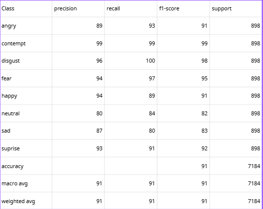

# Facial Expression Recognition using Residual CNN

Dự án này ứng dụng Học Sâu (Deep Learning) để xây dựng một mô hình nhận diện cảm xúc trên khuôn mặt người (Facial Expression Recognition - FER). Mô hình được xây dựng bằng PyTorch và sử dụng kiến trúc mạng nơ-ron tích chập thặng dư (Residual CNN).

---

## 1. Dataset (Dữ liệu)

Dự án sử dụng bộ dữ liệu **FER+ Balanced Dataset**. Đây là bộ dữ liệu đã được tinh chỉnh và cân bằng số lượng mẫu giữa các lớp để mô hình không bị thiên lệch trong quá trình học.

- Số lượng phân lớp: **8 cảm xúc chính**

- Các nhãn (Classes):
  - angry (tức giận)
  - contempt (khinh bỉ)
  - disgust (ghê tởm)
  - fear (sợ hãi)
  - happy (hạnh phúc)
  - neutral (bình thường)
  - sad (buồn bã)
  - suprise (bất ngờ)

### Phân bổ dữ liệu:
- Train set: **51,776 ảnh**
- Validation set: **12,944 ảnh**
- Test set: **7,184 ảnh**

### Tiền xử lý & Data Augmentation:
- Ảnh được chuyển sang **Grayscale**
- Resize về **75x75**

Áp dụng augmentation:
- Random Resized Crop
- Random Horizontal Flip
- Random Rotation (±15°)

---

## 2. Thiết kế Mô hình (Model Architecture)

Dự án sử dụng kiến trúc **Residual CNN** với các **Residual Blocks** và **skip connections** giúp:

- Tránh vanishing gradient
- Huấn luyện mạng sâu hiệu quả hơn
- Trích xuất đặc trưng khuôn mặt tốt hơn


## 3. Kết quả Huấn luyện (Metrics)

Huấn luyện:
- Epochs: **50**
- Batch size: **128**
- Learning rate: **1e-3 (có decay)**

### Kết quả cuối:

- Train Loss: **0.1828**
- Train Accuracy: **93.61%**
- Validation Loss: **0.3027**
- Validation Accuracy: **90.95%**

### Đánh giá:
Mô hình đạt ~**91% accuracy** trên validation set. Khoảng cách giữa train và validation nhỏ → mô hình **generalize tốt**, không bị overfitting nghiêm trọng.

---

## 4. Classification Report


## 5. Hướng dẫn chạy chương trình

### 1. Cài đặt thư viện

Cài đặt các dependencies cần thiết:

```bash
pip install -r requirements.txt 
```

### Chạy chương trình

```bash
streamlit run app.py
```